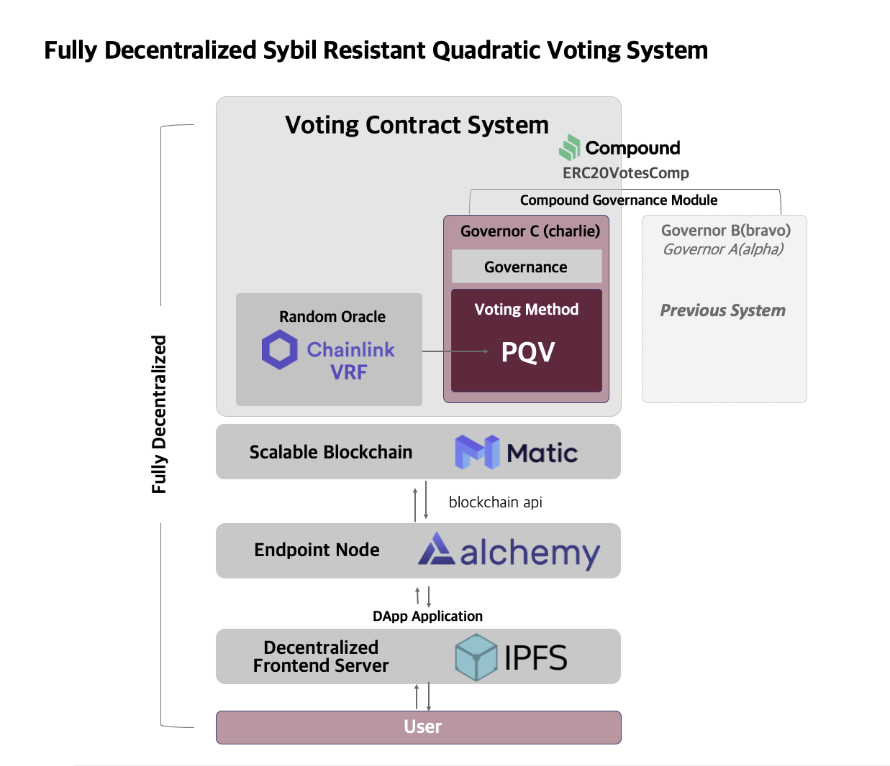
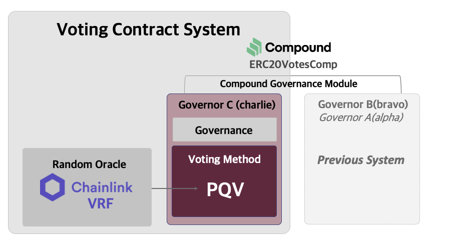

# Governor C: Fully Decentralized Sybil-Resistant Quadratic Voting System

> based on [Chainlink-VRF](https://docs.chain.link/docs/chainlink-vrf/) and [Polygon (Matic)](https://polygon.technology)

# Abstract

Fair voting system is really important for DAO. However, even the most developed voting system, Quadratic Voting (QV), is exposed to the risk of sybil attack.

Therefore we develops **```Governor C```** contract which is a fully decentralized sybil resistant quadratic voting system based on Chainlink-VRF. To achieve sybil resistant, we suggest Probabilistic Quadratic Voting (PQV) method which apply probabilitic element on QV and make it always a loss to do sybil attack.

For the perfect decentralization, we used Chainlink-VRF and scalable blockchain Polygon (Matic).

# Features



The goal of this project is activate the whole decentralized DAO ecosystem. For doing it, we create and built three novel things:

* Probabilistic Quadratic Voting
* Smart contract ```Governor C``` that embodies PQV
* Example of service using ```Governor C```

## Probabilistic Quadratic Voting

> [*Junmo Lee, Sanghyeon Park, and Soo-Mook Moon. "Secure Voting System with Sybil Attack Resistance using Probabilistic Quadratic Voting and Trusted Execution Environment." KIISE Transactions on Computing Practices 27.8 (2021): 382-387.*](https://www.dbpia.co.kr/Journal/articleDetail?nodeId=NODE10594648)

Make it always a loss to do sybil attack by applying probabilitic element on quadratic voting. In PQV, spliting voting power makes the expected value of voting power lower that executing 1 voting power.

QV and PQV shows high similarity through simulation. Also PQV's sybil resistance has been proved.

The more details are in the [`PQV.md`](./docs/PQV.md) and [`PQV-simulator`](https://github.com/Team-DAppO/PQV-simulator).

## Governor Charlie

* Programing language: Solidity v0.8
* Openzeppelin and Chainlink packages are used

To implement the probability factor of PQV without compromising decentralized manner, we use Chainlink-VRF. The contract receives random number everytime user cast a vote and this will make contract more decentralized and cost-efficient.



It follows Compound governance module standard. Therefore current DAOs using compound module based on Governor Bravo can easily apply our new solution which is developed under the same standard.

The more details are in the [`docs/governance`](./docs/governance).

## Example of DAO Service

A demonstration of the bundle of `Governor C` contracts.

We use Polygon (Matic) to enhance scalability of application by using blockchain with lower fees and higher speed.


* You can connect your Metamask wallet directly with the governance site without the KYC which is the centralized proof of identity process. 

* Each proposal can have various stages of status which are active, executed and finalized in this demo.

* User can cast a vote on the proposal with active status.

* The number of votes in front page shows expected value, not the real number of votes. There are also the details of the proposals. For example, user can check the start block number and the end block number of the proposal. After the time of end block created, the proposal will be changed as unfinalized status.

* The finalized proposal is the proposal passed valid voting period, but probabilitic factor of PQV is not applied yet. If someone triggers the calculation of PQV with transaction, it will show the state of succeeded or defeated. 

* To make the status 'succeeded', number of votes on 'for side' of the proposal should be larger thant 'against side'. In addition, the sum of 'for side' votes must be above a certain threshold. Now the result and the expected value of votes turns to the real result. In this demo, the number under 'for side' has changed.

* After the proposal turns to succeeded status, the proposal becomes queued through smart contract named [```Timelock```](./contracts/governance/Timelock.sol). When finally all the process executed, the status turns to 'executed'.

# Future Work

## Governor Delta

> Work-In-Progress\
> D stands for Dynamic

For now, the hyperparameter *`e`* which adjusts the degree of acceptance on PQV is provided by admin as constant. Though we did multiple simulating to get the most suitable value, it doesn't work optimally for all situations.

In `Governor D`, the *`e`* will be dynamically set. It is set to the most appropriate value according to the voting status.

# Thanks for your interest

By providing scalable and decentralized open source solution, we want to activate the entire DAO ecosystem based on fair decision making system. Make more people to engage in healthy governance and community though our solution.

We propose PQV method, smart contracts implementing it, and the service examples. Chainlink-VRF and Polygon (Matic) were used to achieve higher decentralization level.

Team DAppO is continuing research and development to improve the governance system more efficiently and safely. Please look forward to our next solution, `Governor D`.

# Contact

Luke Park (Sanghyeon Park)

> [🖥 https://github.com/lukepark327](https://github.com/lukepark327)\
> [✉️ lukepark327@gmail.com](mailto:lukepark327@gmail.com)

# License

The Governor-C project is licensed under the [MIT](https://opensource.org/licenses/MIT), also included in our repository in the [LICENSE](./LICENSE) file.
