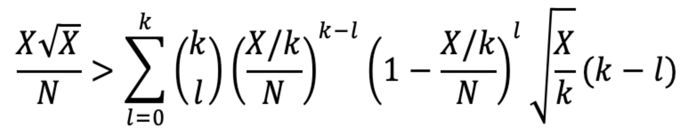

# DAppO

DAppO: DAO Community for DApp developers. Powered by PQV.

<!--
# How-to-use

TBA
-->

# Probabilistic Quadratic Voting

> [*Junmo Lee, Sanghyeon Park, and Soo-Mook Moon. "Secure Voting System with Sybil Attack Resistance using Probabilistic Quadratic Voting and Trusted Execution Environment." KIISE Transactions on Computing Practices 27.8 (2021): 382-387.*](https://www.dbpia.co.kr/Journal/articleDetail?nodeId=NODE10594648)

### Ordinary Voting (One-to-One)

In an ordinary voting method, everyone equally has only one vote. However, in this way, it is simply determined by a majority vote, and there is no way to reflect an individual's desperation because they have same voting power.

### One-person Multi-vote Method (One-to-Many)

To overcome these shortcomings, a one-person multi-vote method has been proposed that allows them to have as many votes as they paid, but there is a problem here that a small number of wealthy participants can decide the result of the voting easily.

### Quadratic Voting (QV)

To solve this problem, a quadratic voting method is presented in which the cost of purchasing votes increases exponentially. However, there is a limitation that quadratic voting is vulnerable to **sybil attacks**, and it is also challenging to establish a secure system that guarantees anonymity and integrity apart from the quadratic voting protocol.

### Probabilistic Quadratic Voting (PQV)

We introduce a secure voting system through **Probabilistic Quadratic Voting (PQV)** and show that the system can keep the value of existing quadratic voting methods.

TBA

# Simulation

TBA

<!--
# References

TBA
-->

# Contact

Luke Park (Sanghyeon Park)

> 🖥 https://github.com/lukepark327\
✉️ lukepark327@gmail.com

# License

The DAppO project is licensed under the [MIT](https://opensource.org/licenses/MIT), also included in our repository in the [LICENSE](./LICENSE) file.
